# Cova — Task Management Application

Full-stack task management platform with a Django REST API, a React web dashboard, and a React Native mobile app.

---

## Table of Contents

- [Architecture](#architecture)
- [Tech Stack](#tech-stack)
- [Project Structure](#project-structure)
- [Installation & Setup](#installation--setup)
- [API Documentation](#api-documentation)
- [Screenshots](#screenshots)
- [License](#license)

---

## Architecture

```
┌──────────────┐     ┌──────────────┐     ┌──────────────┐
│   Frontend   │────▶│    Backend    │◀────│    Mobile     │
│  React/Vite  │     │  Django/DRF   │     │  Expo/React   │
└──────────────┘     └──────────────┘     └──────────────┘
                           │
                     ┌─────┴─────┐
                     │  Database  │
                     │ MySQL/SQLite│
                     └───────────┘
```

- **Backend**: Django REST Framework with JWT authentication, Swagger/ReDoc docs, and MySQL/SQLite support.
- **Frontend**: React 19 + Vite + Tailwind CSS v4 + shadcn/ui, using React Context for state and React Router for navigation.
- **Mobile**: Expo (React Native) with NativeWind and Expo Router for a native iOS/Android experience.

---

## Tech Stack

| Layer       | Technology                                      |
| ----------- | ----------------------------------------------- |
| Backend     | Django 6.1, DRF, Simple JWT, drf-yasg          |
| Frontend    | React 19, Vite 8, Tailwind CSS 4, shadcn/ui   |
| Mobile      | Expo SDK 57, React Native 0.86, NativeWind     |
| Database    | MySQL 8.4 (Docker) / SQLite (local)            |
| Auth        | JWT (access + refresh tokens)                   |
| State       | React Context + useState (web)                  |
| Navigation  | React Router (web), Expo Router (mobile)        |


---

## Project Structure

```
cova-test/
├── backend/                  # Django REST API
│   ├── backend/              # Project settings & URL config
│   ├── users/                # Auth & user management
│   ├── tasks/                # Task CRUD
│   ├── Dockerfile
│   ├── docker-compose.yml
│   └── requirements.txt
├── frontend/                 # React web app
│   ├── src/
│   │   ├── components/       # UI components (shadcn/ui)
│   │   ├── pages/            # Route pages
│   │   ├── hooks/            # Custom hooks
│   │   └── lib/              # Utilities
│   ├── package.json
│   └── vite.config.ts
├── mobile/                   # Expo mobile app
│   ├── src/
│   │   ├── app/              # Expo Router screens
│   │   ├── components/       # UI components
│   │   ├── api/              # API client
│   │   └── auth/             # Auth utilities
│   └── package.json
└── assets/                   # Screenshots
```

---

## Installation & Setup

### Prerequisites

- **Backend**: Python 3.14+, Docker & Docker Compose (optional)
- **Frontend**: Node.js 18+, npm or pnpm
- **Mobile**: Node.js 18+, Expo CLI (`npm install -g expo-cli`)

### Backend

```bash
cd backend

# Local dev (SQLite)
python -m venv venv
source venv/bin/activate
pip install -r requirements.txt
python manage.py migrate
python manage.py runserver
```

API runs at `http://localhost:8000`.

```bash
# Docker (MySQL)
cp .env.example .env   # set USE_MYSQL=True and credentials
docker compose up --build
```

### Frontend

```bash
cd frontend
npm install
npm run dev
```

Web app runs at `http://localhost:5173`.

### Mobile

```bash
cd mobile
npm install
npx expo start
```

Scan the QR code with Expo Go (iOS/Android).

---

## API Documentation

| Endpoint            | URL                                  |
| ------------------- | ------------------------------------ |
| Swagger UI          | http://localhost:8000/swagger/       |
| ReDoc               | http://localhost:8000/redoc/         |
| Django Admin        | http://localhost:8000/admin/         |

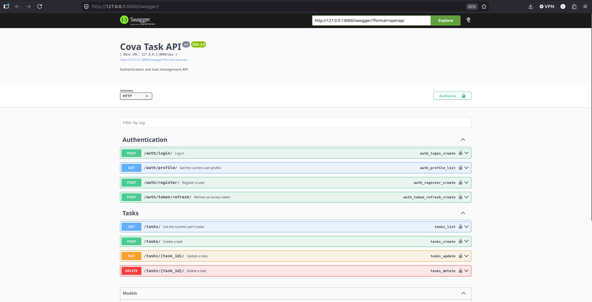

### Authentication

| Method | Endpoint                      | Description              |
| ------ | ----------------------------- | ------------------------ |
| POST   | `/api/auth/register/`         | Register new account     |
| POST   | `/api/auth/login/`            | Login, receive JWT       |
| POST   | `/api/auth/token/refresh/`    | Refresh access token     |
| GET    | `/api/auth/profile/`          | Get current user profile |

### Tasks

| Method | Endpoint               | Description     |
| ------ | ---------------------- | --------------- |
| GET    | `/api/tasks/`          | List all tasks  |
| POST   | `/api/tasks/`          | Create a task   |
| PUT    | `/api/tasks/{id}/`     | Update a task   |
| DELETE | `/api/tasks/{id}/`     | Delete a task   |

> All task endpoints require `Authorization: Bearer <token>`.

---

## Screenshots

### Web — Dashboard & Auth

| Sign In | Sign Up |
| ------- | ------- |
| 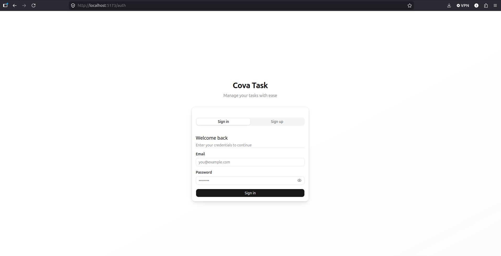 | 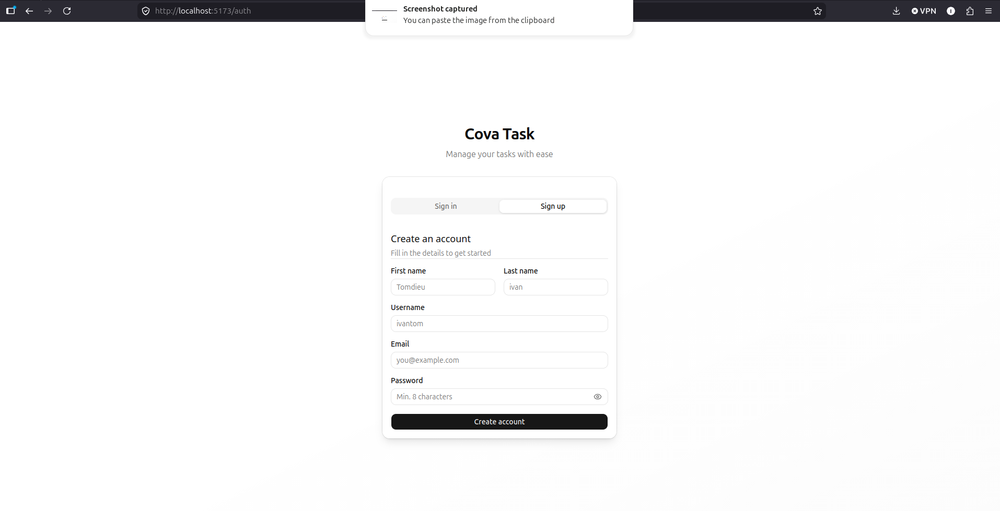 |

| Dashboard | Add Task | Edit Task |
| --------- | -------- | --------- |
| 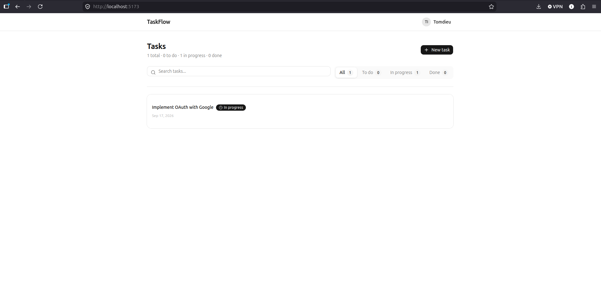 | 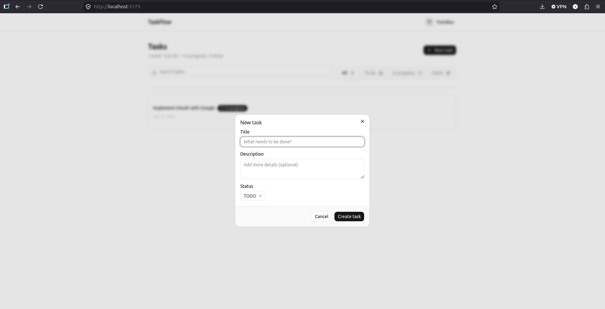 |  |

### Mobile

| Sign In | Sign Up | Profile |
| ------- | ------- | ------- |
| 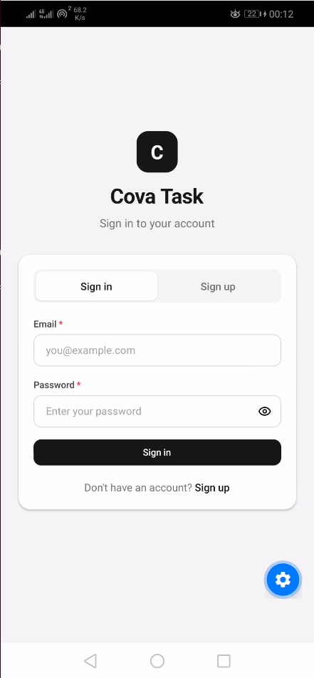 | 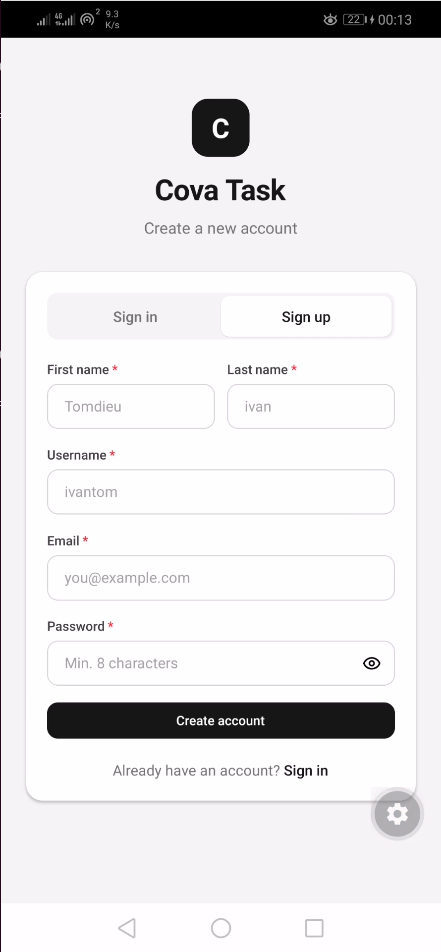 | 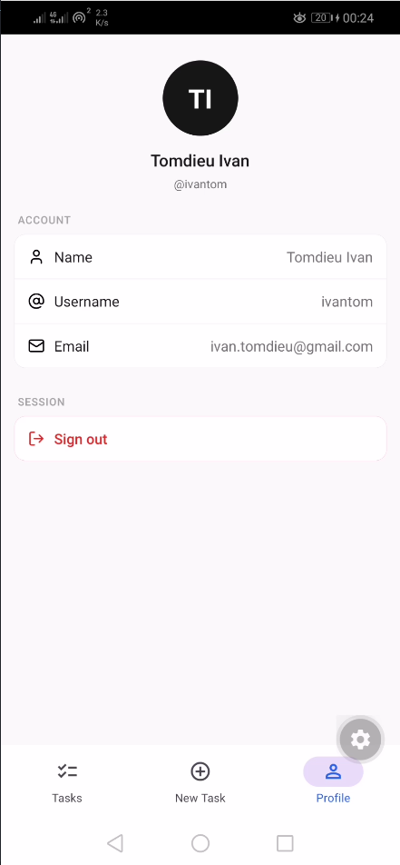 |

| Task List | Create Task | Update Task |
| --------- | ----------- | ----------- |
| 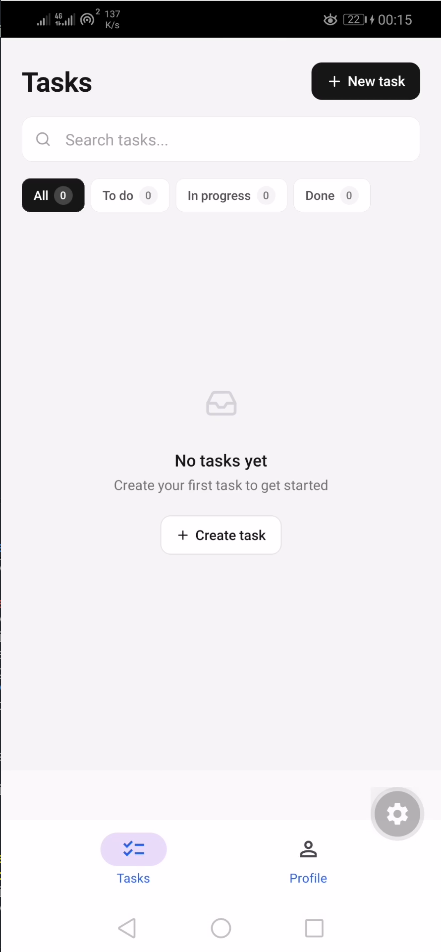 | 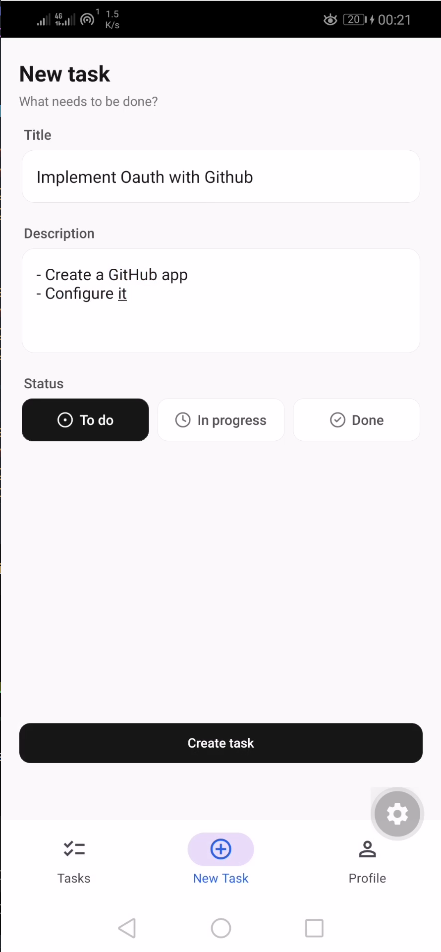 | 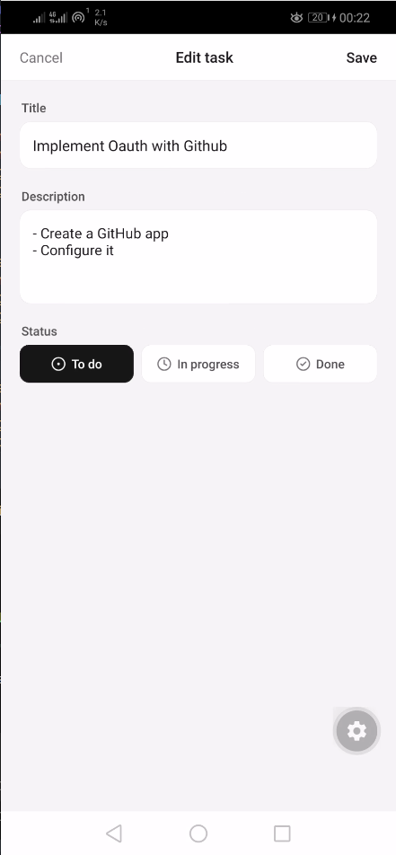 |

---

## License

MIT
